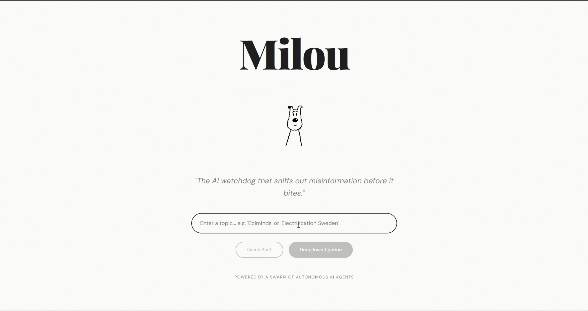
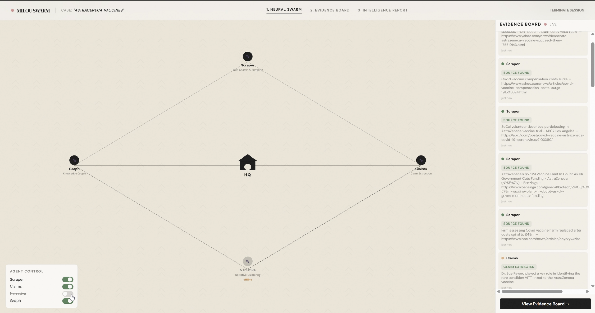
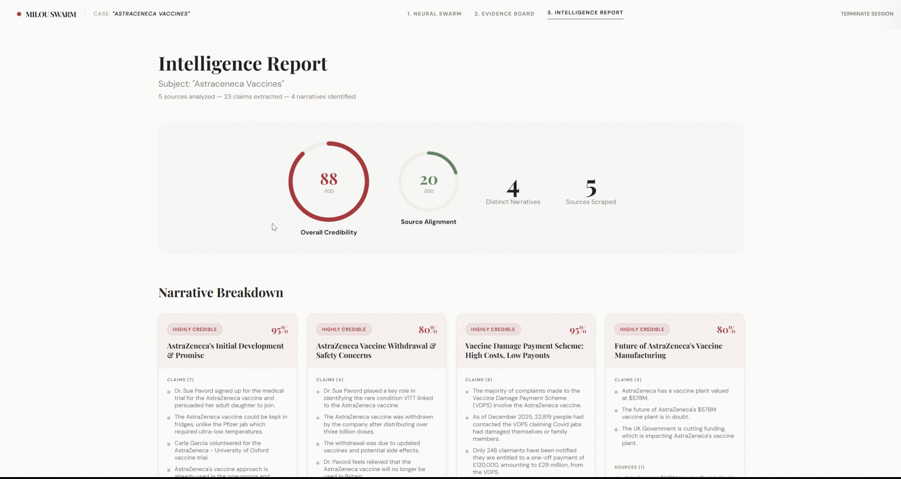
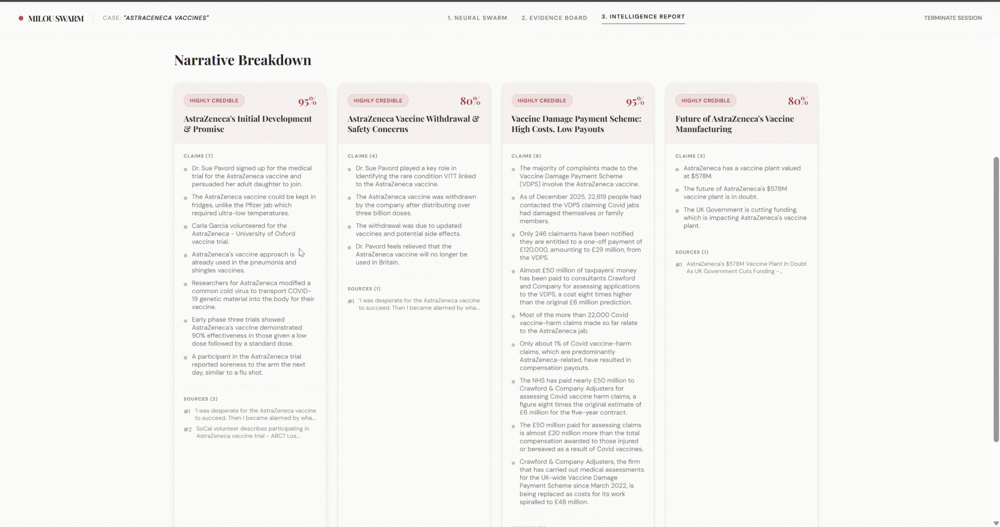

# Milou — The AI Watchdog

> **Autonomous OSINT & Narrative Intelligence through Decentralized Multi-Agent Systems**

---

<div align="center">

### 🏆 Top 5 Finalist — Google x Epiminds Swarm Intelligence Hackathon
#### Stockholm, March 2026

</div>

---

## Overview

Milou is a narrative intelligence system that deploys a **swarm of autonomous AI agents** to map online discourse and surface disinformation in near real-time. A user submits a topic; within seconds, the swarm has scraped live sources, extracted factual claims, clustered them into narrative threads, and rendered a structured intelligence report — with zero human intervention between trigger and result.

The system is engineered around a **Decentralized Blackboard Architecture**: agents share no direct channels of communication, no agent orchestrates another, and the system carries no hidden coordinator. Coordination emerges purely through shared state — a design borrowed from classical distributed AI and applied to modern LLM-powered agents.

---

## Demo

| Prompt | Swarm Activity | Intelligence Report | Evidence Board |
|---|---|---|---|
|  |  |  |  |

| Live Swarm (10 agents) | Report — Extended View |
|---|---|
|  |  |

---

## System Flow

```
User Input (topic)
       │
       ▼
  POST /topic
       │
       ▼
┌──────────────────────────────────────────┐
│             Shared Blackboard            │
│  { topic, documents, claims,             │
│    narratives, graph, agent_status }     │
└──────┬────────────┬──────────┬───────────┘
       │            │          │           │
       ▼            ▼          ▼           ▼
    Scout        Veritas     Linguist    Ghost
  (Scraper)     (Claims)  (Narratives)  (Graph)
       │            │          │           │
       └────────────┴──────────┴───────────┘
                        │
                        ▼
              GET /context (polled every 1.5s)
                        │
                        ▼
              React Dashboard (SwarmPage → ResultsPage)
```

---

## Architecture Deep Dive

### The Blackboard Pattern

The Blackboard pattern is a classical AI architecture for problems where no single algorithm can produce a complete solution alone. Multiple independent **Knowledge Sources** (agents) observe a shared **Blackboard** (the context store) and contribute partial solutions as their preconditions are met.

In Milou, the blackboard is a single in-process Python dictionary served over a FastAPI REST interface:

```python
shared_context = {
    "topic":       "",      # Trigger — written by the user via POST /topic
    "documents":   [],      # Written by Scout; read by Veritas
    "claims":      [],      # Written by Veritas; read by Linguist and Ghost
    "narratives":  [],      # Written by Linguist; read by Ghost
    "graph":       {},      # Written by Ghost; read by the frontend
    "agent_status": {
        "scraper":   "idle | running | done",
        "claim":     "idle | running | done",
        "narrative": "idle | running | done",
        "graph":     "idle | running | done"
    }
}
```

No agent holds a reference to any other agent. Each agent polls the blackboard on a fixed interval, checks whether its required input keys are populated, executes its function if preconditions are satisfied, and writes its output back to the blackboard. The system is fully event-driven through state inspection alone.

### Stigmergy

Milou implements **stigmergy** — the biological principle by which agents coordinate through modifications to their shared environment rather than through direct messaging or commands. The mechanism is identical to that used by ant colonies: each agent leaves a "trace" on the blackboard (e.g., `documents`, `claims`) that acts as an indirect signal to downstream agents.

This has a critical engineering consequence: **adding a new agent requires zero changes to existing agents.** A new specialist simply declares what keys it reads and what keys it writes. The swarm self-organizes around it.

### State Persistence — Perfect Memory

The blackboard maintains the full investigation state for the lifetime of the session. Every document scraped, every claim extracted, every narrative discovered, and every graph edge computed is preserved in the shared context and served via `GET /context`. The frontend polls this endpoint every 1.5 seconds, giving the dashboard a live, consistent view of the swarm's collective memory at any point in time.

A `POST /reset` endpoint wipes the blackboard and returns all agents to `idle`, enabling the next investigation without restarting the server process.

---

## Agent Taxonomy

| Agent | Codename | Role | Technology | Blackboard Writes |
|---|---|---|---|---|
| **Scout** | `scraper_agent` | Data Ingestion & OSINT | DuckDuckGo News API, BeautifulSoup4, `requests` | `documents[]` |
| **Veritas** | `claim_agent` | Forensic Claim Extraction | Gemini 2.5 Flash (structured LLM output) | `claims[]` |
| **Linguist** | `narrative_agent` | Semantic Clustering & Narrative Mapping | Gemini 2.5 Flash (few-shot clustering prompt) | `narratives[]` |
| **Ghost** | `graph_agent` | Network & Relationship Analysis | Pure graph construction (nodes + directed edges) | `graph{}` |

### Agent Detail

**Scout** performs live OSINT by querying DuckDuckGo News for the user's topic, filtering blocked domains (social platforms, paywalled networks), and scraping up to 5 clean article bodies using a multi-fallback title extraction strategy (HTML title → OpenGraph → H1). Output is stored as structured document objects on the blackboard.

**Veritas** reads each unprocessed document from the blackboard incrementally, submits it to Gemini 2.5 Flash with a forensic extraction prompt, and writes back a structured list of factual claims per source. Processing is tracked via `claims_processed_count` to avoid re-processing on each polling cycle — enabling incremental, streaming-style operation.

**Linguist** activates only after both Scout and Veritas have reached `done` status. It flattens all claims across all sources into a single corpus and instructs Gemini 2.5 Flash to cluster them into 3–5 narrative themes. A deterministic fallback ensures no claim is silently dropped — any claim omitted by the LLM is re-assigned to prevent data loss.

**Ghost** constructs a directed graph from the finalized blackboard state: source nodes connect to claim nodes, claim nodes connect to narrative nodes. The resulting `{ nodes, edges }` structure is consumed directly by the React frontend's graph renderer. Ghost is stateless beyond reading existing blackboard keys — it has no internal memory.

---

## Resilience & Scalability

### Chaos Mode — Agent Kill-Switch

Each agent runs as a **daemon thread** with independent error handling. An exception inside any single agent is caught, logged, and causes that agent's status to return to `idle` for a retry on the next poll cycle. No exception propagates to other agents or crashes the server.

The `agent_status` map on the blackboard makes the health of every agent observable in real-time. The frontend's SwarmPage visualizes this state directly — a dead or stalled agent is immediately visible as a node that fails to transition from `running` to `done`. This transparency turns failure into a diagnostic signal rather than a silent outage.

```python
# From agent_runner.py — resilience loop
try:
    result = agent_fn(context)
    context["agent_status"][name] = "done" if result is True else "idle"
except Exception as e:
    print(f"[{name}] error: {e}")
    context["agent_status"][name] = "idle"   # Self-heals on next cycle
```

The `POST /reset` endpoint functions as a system-wide kill-switch: it clears all blackboard state and returns every agent to `idle` without restarting any thread. The swarm recovers and is ready for a new investigation within one polling interval.

### Horizontal Scalability

The blackboard architecture scales horizontally without refactoring existing agents. Extending the system requires only:

1. Define a new agent function with the signature `agent_fn(context: dict) -> bool | None`
2. Declare which blackboard keys it reads (preconditions) and which it writes (outputs)
3. Register it in `agent_runner.py`

No existing agent needs to be modified. No orchestrator needs to be updated. The swarm self-organizes. Illustrative extensions:

| Proposed Agent | Reads | Writes |
|---|---|---|
| **Arbiter** (cross-source contradiction detection) | `claims` | `contradictions[]` |
| **Cartographer** (geo-tagging of sources) | `documents` | `geo_metadata[]` |
| **Chronos** (temporal narrative drift analysis) | `narratives` | `timeline{}` |

---

## Key Results

| Metric | Result |
|---|---|
| **Time-to-Truth** | Full narrative map (scrape → claims → clustering → graph) delivered in **< 60 seconds** for a 5-source investigation |
| **Pipeline Parallelism** | 4 agents execute concurrently as daemon threads; no sequential blocking between scraping and claim extraction |
| **Claim Coverage** | Zero-drop guarantee: every extracted claim is assigned to exactly one narrative through a deterministic LLM fallback |
| **Fault Tolerance** | Single-agent failure causes zero cascade — swarm self-heals within one 2-second polling cycle |
| **Horizontal Extensibility** | New specialist agents can be registered without modifying any existing agent — O(1) integration cost |
| **Hackathon Outcome** | **Top 5 of all submissions** at the Google x Epiminds Swarm Intelligence Hackathon, Stockholm 2026 |

---

## Tech Stack

| Layer | Technology |
|---|---|
| **Frontend** | React 18, TypeScript, Vite, TailwindCSS, shadcn/ui |
| **Backend** | Python 3, FastAPI, Uvicorn |
| **LLM** | Google Gemini 2.5 Flash |
| **OSINT** | DuckDuckGo Search API, BeautifulSoup4 |
| **Transport** | HTTP polling — `GET /context` every 1.5s |
| **Concurrency** | Python `threading.Thread` (daemon mode) |

---

## Running Locally

### Prerequisites

- Python 3.10+
- Node.js 18+
- A `GEMINI_API_KEY` from [Google AI Studio](https://aistudio.google.com)

### Backend

```bash
pip install -r requirements.txt

# Create a .env file with your API key
echo "GEMINI_API_KEY=your_key_here" > .env

uvicorn Backend.main:app --reload
# → http://localhost:8000
```

### Frontend

```bash
cd milou_Emil/frontend
npm install
npm run dev
# → http://localhost:5173
```

### API Reference

| Method | Endpoint | Description |
|---|---|---|
| `POST` | `/topic` | Submit a topic and trigger the swarm |
| `GET` | `/context` | Return the full blackboard state |
| `POST` | `/reset` | Wipe the blackboard and reset all agents to idle |

---

## Repository Structure

```
epiminds-hackathon/
├── Backend/
│   ├── main.py          # FastAPI app, CORS, startup hooks
│   ├── context.py       # Shared blackboard definition
│   └── agent_runner.py  # Daemon thread factory and registration
├── agents/
│   ├── scraper_agent.py   # Scout  — OSINT & web scraping
│   ├── claim_agent.py     # Veritas — LLM claim extraction
│   ├── narrative_agent.py # Linguist — narrative clustering
│   └── graph_agent.py     # Ghost — graph construction
├── milou_Emil/frontend/   # React dashboard (SwarmPage, ResultsPage, CrimeBoardPage)
├── Figures/               # Screenshots and demo assets
├── ARCHITECTURE.md        # System architecture reference
└── requirements.txt
```
